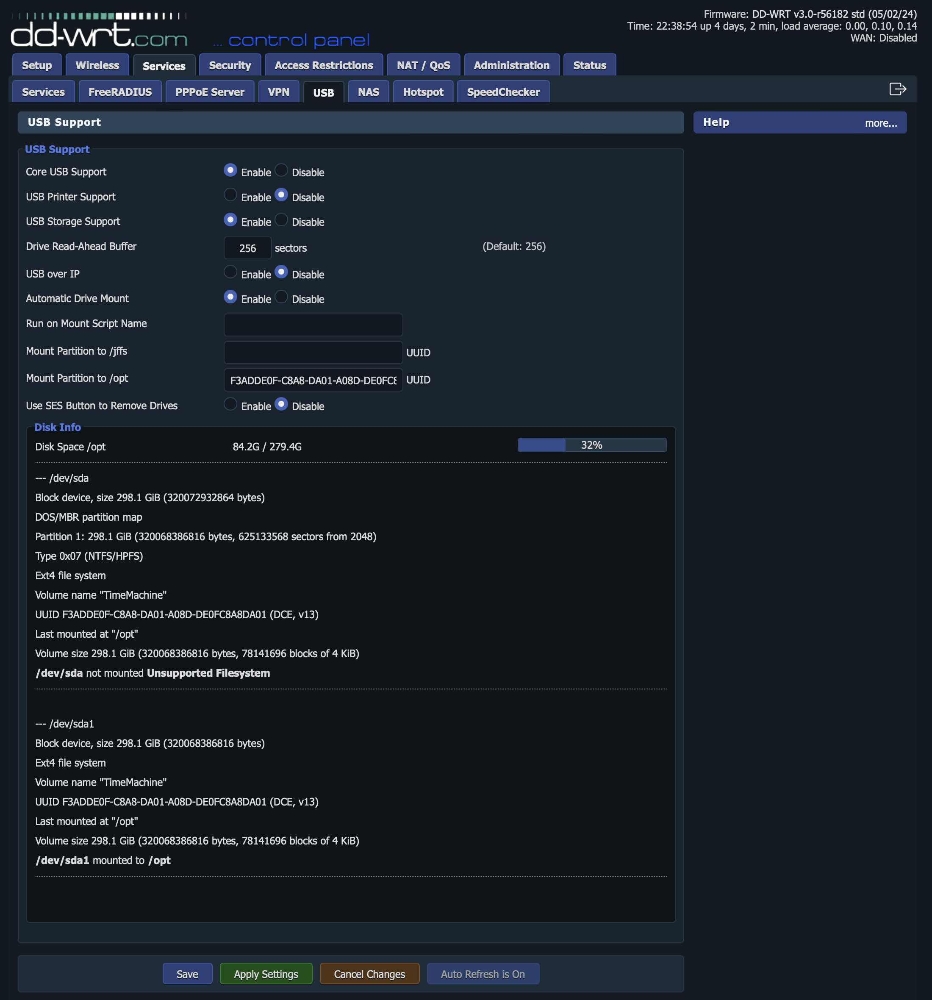
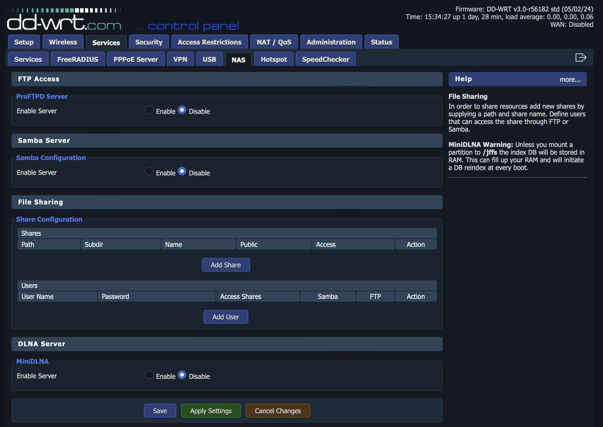

# TimeMachine on DD-WRT

To set up Time Machine on a DD-WRT capable router, you'll need to configure the router to support *direct-attached storage* (DAS) and then enable *Samba*. Here's a step-by-step guide to help you through the process.

## Prerequisites

- **DD-WRT firmware installed:** Ensure your router has DD-WRT installed. You can find the firmware and installation instructions on the DD-WRT website.
- **External storage device:** You’ll need a USB drive or an external hard drive to connect to your router.
- **Basic networking knowledge:** Familiarity with DD-WRT and basic networking concepts.

## Step-by-Step Instructions

1. Partition and format an external hard drive
    - The process is out of the scope of this tutorial because there are already a lot of information available on internet.
    - In the following we are using a single EXT4 partition but it should work also with exFAT.
      
2. Connect to Your Router
    - Access your DD-WRT router’s web interface by entering the router's IP address (usually 192.168.1.1) in your web browser.
    - Log in with your admin username and password.

3. Connect and Mount the External Storage

    - Plug your USB drive or external hard drive into the router’s USB port (USB3 port is better).
    - Go to **Services > USB** in the DD-WRT web interface.
        - Enable *Core USB Support*
        - Enable *USB Storage Support*
        - Enable *Automatic Drive Mount*
        - **Apply Settings** and the disk will be temporary mounted on `/tmp/mnt/sda1`
        - Copy and paste UUID from Disk Info to *Mount partition to /opt*
        - **Save**
        - **Apply Settings**
        - Reboot your router and your drive should be automatically mounted on `/opt`
     
        

4. Disable the built-in Samba server
   - Go to **Services > NAS** in the DD-WRT web interface.

     **Disable** the following options:
        - *Samba Server > Samba Configuration > Enable Server*
          
        

5. Connect to Your Router via Terminal

   On macOS open a Terminal and run:
   ```
   ssh 192.168.1.1 -l root
   ```
   Enter `root` password when requested.
   ```
   alf45tar@alf45tar-iMac ~ % ssh 192.168.1.1 -l root
   DD-WRT v3.0-r56182 std (c) 2024 NewMedia-NET GmbH
   Release: 05/02/24
   Board: TP-Link Archer C9
   root@192.168.1.1's password: 
   ==========================================================
 
         ___  ___     _      _____  ______       ____  ___ 
        / _ \/ _ \___| | /| / / _ \/_  __/ _  __|_  / / _ \
       / // / // /___/ |/ |/ / , _/ / /   | |/ //_ <_/ // /
      /____/____/    |__/|__/_/|_| /_/    |___/____(_)___/ 
                                                     
                           DD-WRT v3.0
                       https://www.dd-wrt.com


    ==========================================================


    BusyBox v1.36.1 (2024-05-02 04:40:12 +07) built-in shell (ash)

    root@TimeCapsule:~#
    ```
   
6. Intall Entware the ultimate repo for embedded devices
   
   [Entware](https://entware.net) is a software repository for embedded devices like routers or network attached storages. >1800 packages are available. It was founded as an alternative to very outdated Optware packages.
   List of Entware packages for ARMv7 is [here](http://bin.entware.net/armv7sf-k3.2/Packages.html).

   Type in the following commands:
   ```
   cd /opt
   wget http://bin.entware.net/armv7sf-k3.2/installer/generic.sh
   sh generic.sh
   ```
   When installation is complete, run an update:
   ```
   opkg update
   opkg upgrade
   ```
7. Install required packages
   ```
   opkg install avahi-autoipd avahi-dbus-daemon avahi-dnsconfd avahi-utils
   opkg install samba4-admin samba4-client samba4-libs samba4-server samba4-utils
   ```
8. Edit/replace `/opt/etc/samba/smb.conf` with
   ```
   [global]
   # Fruit global config
   fruit:aapl = yes
   fruit:nfs_aces = no
   fruit:copyfile = no
   fruit:model = MacSamba

   # Permissions on new files and directories are inherited from parent directory
   inherit permissions = yes

   # Change this to the workgroup/NT-domain name your Samba server will part of
   workgroup = WORKGROUP
   # Samba will automatically "register" the presence of its server to the rest of the network using mDNS.
   # Since we are using avahi for this we can disable mdns registration.
   multicast dns register = no

   # Server string is the equivalent of the NT Description field
   server string = %h server (Samba, DD-WRT)

   # Protocol versions
   client max protocol = default
   client min protocol = SMB2_02
   server max protocol = SMB3
   server min protocol = SMB2_02

   # This tells Samba to use a separate log file for each machine that connects
   log file = /opt/var/log/samba/log.%m

   # Cap the size of the individual log files (in KiB).
   max log size = 1000

   # We want Samba to only log to /var/log/samba/log.{smbd,nmbd}.
   # Append syslog@1 if you want important messages to be sent to syslog too.
   logging = file

   #======================= Share Definitions =======================

   [timemachine]
   # Load in modules (order is critical!)
   vfs objects = catia fruit streams_xattr
   fruit:encoding = native
   fruit:time machine = yes
   comment = Time Machine Backup
   path = /opt/timemachine
   available = yes
   valid users = timemachine
   browseable = yes
   guest ok = no
   writable = yes
   ```
   
9. Create the folder to save the TimeMachine backup
   ```
   cd /opt
   mkdir timemachine
   chown root:samba timemachine
   chmod 770 timemachine
   ```

10. Set Samba password for user `timemachine`
    ```
    smbpasswd -a timemachine
    ```

11. Create `/opt/etc/avahi/services/samba.service` with
    ```
    <?xml version="1.0" standalone='no'?>
    <!DOCTYPE service-group SYSTEM "avahi-service.dtd">
    <service-group>
      <name replace-wildcards="yes">%h</name>
      <service>
        <type>_smb._tcp</type>
        <port>445</port>
      </service>
      <service>
        <type>_device-info._tcp</type>
        <port>0</port>
        <txt-record>model=TimeCapsule8,119</txt-record>
      </service>
      <service>
        <type>_adisk._tcp</type>
        <txt-record>dk0=adVN=timemachine,adVF=0x82</txt-record>
        <txt-record>sys=waMa=0,adVF=0x100</txt-record>
      </service>
    </service-group>
    ```
    
12. Add startup and shutdown script

    - Go to **Adminstration > Commands** in the DD-WRT web interface.

    Add the following to **Startup**
    ```
    #
    # Add group and user for avahi server
    #
    echo "nogroup:x:114:nobody" >> /etc/group
    echo "nobody:*:114:114:avahi:/opt/sbin/avahi-daemon:/bin/false" >> /etc/passwd
    #
    # Add group for Samba server
    #
    echo "samba:x:1000:timemachine" >> /etc/group
    echo "timemachine:*:1001:1000:TimeMachine::/bin/false" >> /etc/passwd
    #
    # Wait until external storage i smounted under /opt
    #
    /bin/sh -c 'until [ -f /opt/etc/init.d/rc.unslung ]; do sleep 1 ; done'
    #
    # Start all Entware services (Avahi, Samba)
    #
    /opt/etc/init.d/rc.unslung start
    #
    # Set external storage sleep time to 15 minutes
    #
    for i in /dev/sd?; do hdparm -S 180 $i > /dev/null; done
    ```

    Add  the following to **Shutdown**
    ```
    #
    # Stop all Entware services before shutdown
    #
    /opt/etc/init.d/rc.unslung stop
    ```
